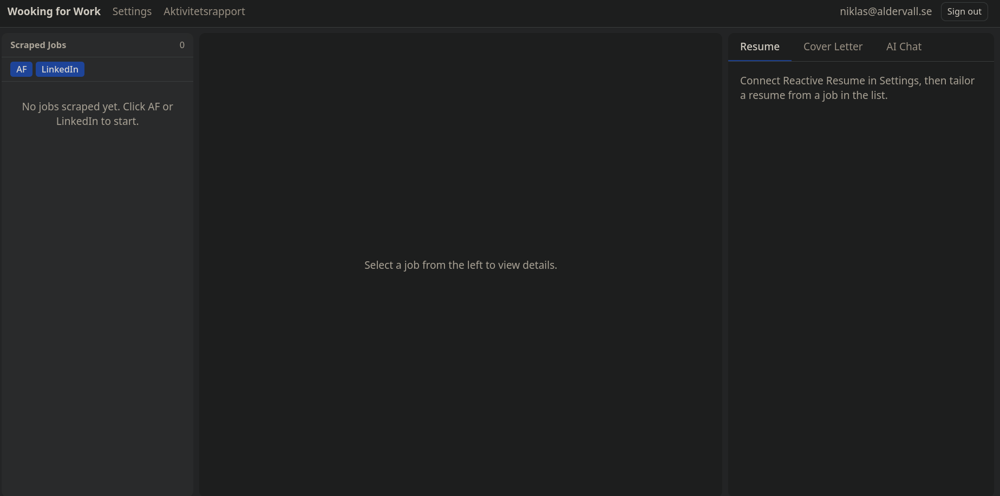

# Wooking for Work


**AI-assisted job hunting automation for the Swedish/European IT job market.**

A modular framework built on [opencode](https://opencode.ai) that connects Reactive Resume (CV management), AFFiNE (document hub), and MCP servers (Arbetsförmedlingen, LinkedIn, Context7) into a streamlined job application pipeline.

## Architecture

```
┌─────────────────────────────────────────────────────────┐
│  opencode (AI agent orchestration)                       │
│  ┌──────────────┐  ┌───────────┐  ┌──────────────────┐  │
│  │ Job Scraper   │  │ Resume    │  │ Resume Optimizer  │  │
│  │ @job-scraper  │  │ Tailor    │  │ @resume-optimizer │  │
│  │               │  │ @resume-  │  │ (CrewAI pipeline) │  │
│  │               │  │ tailor   │  │                    │  │
│  └──────┬───────┘  └─────┬─────┘  └────────┬─────────┘  │
│         │                │                  │            │
└─────────┼────────────────┼──────────────────┼────────────┘
          │                │                  │
    ┌─────▼─────┐    ┌─────▼─────┐     ┌─────▼─────┐
    │AF + LI    │    │Reactive   │     │AFFiNE     │
    │Job Search │    │Resume API │     │Documents  │
    │(MCP)      │    │(MCP)      │     │(MCP)      │
    └───────────┘    └───────────┘     └───────────┘
```

## Prerequisites

| Tool | Version | Required For |
|------|---------|-------------|
| [opencode](https://opencode.ai) | ≥ 0.x | AI agent runtime |
| [Node.js](https://nodejs.org) | ≥ 18 | `npx` for Arbetsförmedlingen MCP |
| [Python](https://python.org) | 3.10–3.12 | CrewAI resume optimizer |
| [uv](https://docs.astral.sh/uv) | ≥ 0.4 | Python dependency manager |
| [Xvfb](https://www.x.org/releases/X11R7.6/doc/man/man1/Xvfb.1.xhtml) | any | LinkedIn headless browser |
| [affine-mcp](https://github.com/me/affine-mcp) | latest | AFFiNE MCP server |

## Quick Start

### 1. Clone and configure
### 2. Fill in `.env`
### 3. Install dependencies
### 4. Start opencode

## Full Stack Development

This project now includes a full-stack implementation with a React frontend and Express backend.

### Running the full application

1. **Start the backend API server:**
   ```bash
   npm run dev
   ```
   The backend runs on `http://localhost:3001` with API endpoints at `/api/`.

2. **Start the frontend development server:**
   ```bash
   cd frontend
   npm run dev
   ```
   The frontend runs on `http://localhost:3002` and proxies API requests to the backend.

3. **Access the application:**
   - Frontend: `http://localhost:3002`
   - Backend API: `http://localhost:3001/api/`
   - Database: SQLite file at `data/wooking.db`

### Important commands

- `npm start` - Run backend in production mode
- `npm run dev` - Run backend with watch mode
- `npm run seed` - Seed the database with initial data
- `npm run db:reset` - Reset database (deletes all data)
- `cd frontend && npm run dev` - Start frontend dev server

### Project structure

```
├── backend/
│   ├── src/
│   │   ├── api/           # API endpoints
│   │   ├── database/      # Database setup and schema
│   │   ├── models/        # Data models
│   │   └── server.js      # Main server file
│   ├── package.json       # Backend dependencies
│   └── data/              # SQLite database files
├── frontend/
│   ├── src/
│   │   ├── components/    # React components
│   │   ├── hooks/         # Custom hooks
│   │   ├── api.js         # API client
│   │   └── App.jsx        # Main application
│   ├── public/            # Static assets
│   └── package.json       # Frontend dependencies
├── .env.example           # Template for environment variables
├── opencode.json          # MCP and agent configuration
└── AGENTS.md              # Agent overview and quick reference
```

### Database

The application uses SQLite with a file-based database at `data/wooking.db`. You can reset the database with:

```bash
npm run db:reset
```

This will delete the existing database and recreate it with seed data.

### Environment variables

In addition to the existing variables, you may need to set:

- `DATABASE_URL` (optional) - Override the default SQLite database path
- `FRONTEND_URL` (optional) - Frontend URL for CORS configuration

### Development notes

- The backend uses Express.js and better-sqlite3 for database access
- The frontend uses React with Vite for fast development
- API calls from frontend are proxied to `/api/` (configured in `frontend/vite.config.js`)
- Hot-reload is enabled for both frontend and backend (with `--watch`)

```bash
opencode
```

All MCP servers are **enabled by default** in `opencode.json`. The framework reads all secrets from `{env:VAR}` references. You only ever edit `.env`.

## MCP Authentication

| MCP | Auth Method | First-time Setup |
|-----|-------------|-----------------|
| **Arbetsförmedlingen** | None (public API) | Nothing — works out of the box |
| **Context7** | None (public API) | Nothing — works out of the box |
| **Reactive Resume** | OAuth | Set `RXRESUME_MCP_URL` in `.env`. On first MCP call, opencode opens a browser for OAuth login to your RxResume instance |
| **AFFiNE** | Bearer token | Set `AFFINE_BASE_URL` + `AFFINE_API_TOKEN` in `.env`. Generate token from AFFiNE Settings → Workspace → API Tokens |
| **LinkedIn** | Password + browser session | Set `LINKEDIN_EMAIL` + `LINKEDIN_PASSWORD` in `.env`. Run one-time login: `xvfb-run uvx linkedin-scraper-mcp@latest --login` (saves session to `~/.linkedin-mcp/profile/`) |

## Project Structure

```
├── .env.example          # Template for environment variables
├── opencode.json         # MCP and agent configuration
├── AGENTS.md             # Agent overview and quick reference
├── .opencode/
│   ├── agents/           # Agent definitions (@name)
│   │   ├── job-scraper.md
│   │   ├── resume-tailor.md
│   │   ├── resume-optimizer.md
│   │   ├── affine-docs.md
│   │   └── research.md
│   └── rules/            # Workflow rules (auto-loaded)
│       ├── workflow-standards.md
│       ├── resume-operations.md
│       ├── job-listings-affine.md
│       ├── activity-report.md
│       ├── mcp-usage.md
│       └── coding-standards.md
├── src/resume_optimizer/  # CrewAI multi-agent optimizer
│   ├── main.py            # CLI entry point
│   ├── crew.py            # Agent/task definitions
│   ├── models.py          # Pydantic data models
│   └── config/            # Agent & task YAML configs
├── scripts/
│   ├── linkedin-mcp.sh    # LinkedIn browser launcher
│   └── scrape-wise-jobs.py
├── resumes/
│   ├── templates/         # Anonymized resume structure examples
│   └── tailored/          # Tailored resumes (gitignored — personal)
├── cover-letters/         # Cover letters (gitignored — personal)
└── job-listings/          # Scraped job listing exports
```

## Usage

### Search for jobs

```bash
# Via opencode agent
@job-scraper
```

### Tailor a resume for a specific job

```bash
# Via opencode agent
@resume-tailor
```

### Run the CrewAI optimizer

```bash
PYTHONPATH=src uv run --directory src/resume_optimizer python -m resume_optimizer.main \
  --job-listing /tmp/job_listing.json \
  --job-enrichment /tmp/job_enrichment.json \
  --resume /tmp/resume.json \
  --company-name "Company AB"
```

### Run the activity report

```bash
# Via opencode agent (monthly)
@affine-docs
# Follow the workflow in .opencode/rules/activity-report.md
```

## Customization

1. **Search locations** — Edit `[your-city]`, `[your-radius]` placeholders in `.opencode/rules/*.md` to match your commuting area
2. **AFFiNE folder structure** — Create your workspace folder hierarchy, then update parent IDs in `AGENTS.md` and `.opencode/agents/affine-docs.md`
3. **Job roles/keywords** — Update the keyword lists in `.opencode/agents/job-scraper.md` and `.opencode/rules/mcp-usage.md`
4. **Resume templates** — Fetch your base resume from RxResume via `reactive_resume_get_resume`, save to `resumes/templates/`
5. **LLM model** — Set `OPENAI_MODEL` in `.env` (default: `gpt-4o`)

## Security

- **Never commit** `.env`, `resumes/**/*.json`, `cover-letters/*.json`, or `*.pdf`
- All secrets are sourced from `{env:VAR}` in `opencode.json` — zero hardcoded credentials
- `.gitignore` is pre-configured to protect personal data
- The framework **never auto-sends** applications — everything is saved locally for your review

## License

MIT — see [LICENSE](./LICENSE).
